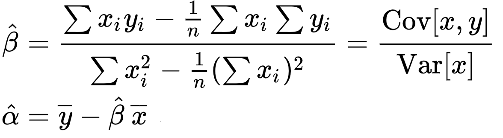

# Simple Linear Regression

Here we're gonna discuss the Simple Linear Regression.

The simple linear regression is a way of describing a linear relationship between dependent and independent
variables. To expand the idea, let's say we think that there's linear relationship between the total time
that a student studies and his GPA. Using Simple Linear Regression model, given the total hours of studying
we can predict the GPA.

In the formula shown above

 - `Yi` is the predicted value (dependent variable)
 - `Xi` is the feature value (independent variable)
 - `beta<0>` is the y-intercept which represents the value that `Yi` will get if `Xi` will be 0
 - `beta<1>` is the slope
 - `epsilon` is the error term which shows the difference between true population `Y` value and the predicted `Y` value

Given the data, the basic idea of Simple Regression is to fit a line which has the lowest total error.
The error is the difference between the actual value and predicted value. There are multiple methods of error calculation.
The sum of squares of errors, the sum of absolute errors, etc. Mostly, the squared version is used. The reason we're adding the square of errors is 
that we don't want the errors to just cancel out each other. For example, 
if the error is in one prediction is too high and the next one is too low they would just cancel out each other and 
we don't want that. That's why we square the errors.

Ordinary Least Squares is one of the methods that are used in regression which tries to minimize the sum of squared errors. It is used to find y-intercept and the slope.
The formula is as follows

 - symbols with hats are predicted values of alpha and beta
 - symbols with bars are mean values
 - Cov represents covariance
 - Var represents variance
 
The cost function that is used is MSE (Mean Squared Error).

The way that the regression is done is through reducing the cost function and to do so, Gradient 
Descent is used. Basically, using gradient descent the steepest decrease of cost function is found.

*Source: [Linear Regression by Davi Frossard](https://www.cs.toronto.edu/~frossard/post/linear_regression/#mjx-eqn-eqmodel_loss)*

This is how the line is fitted through number of iterations
