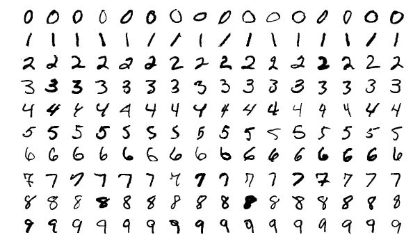

# Introduction to Neural Networks using [Keras](https://keras.io)
## Predicting hand-written numbers

#### Importing the dependencies

The first thing that we're gonna do is to import the Keras library which is built on top of [Tensorflow](https://www.tensorflow.org) library. But before, make sure you got Python 3.6 because Tensorflow won't work with Python 3.7 as of now. To import Keras do the following:
```python
import tensorflow.keras as keras
``` 

#### Loading the dataset

The very next thing is to load the dataset - [MNIST](http://yann.lecun.com/exdb/mnist/) which is in fact 28x28 unique, handwritten, grayscaled images of digits from 0-9 as following



To get the dataset we write the subsequent line
```python
mnist = keras.datasets.mnist
```

#### Splitting the data

Let's divide data into training and test data. Training data will be used to train our model. Using it our model will learn. Test data is the data that our model has never experienced, hence it will be used to determine the level of accuracy of our trained model.
To split the data into test and train:
```python
(x_train, y_train), (x_test, y_test) = mnist.load_data() #tuple unpacking is used here
```
Here it is easy because the dataset is ready and it is designed to be this way. In reality it is not this easy.
Here's the explanation of what is what:
 - `x_train` is the array of digit images.
 - `y_train` is the array of digits that corresponds to the digit images.
 
For example  
 ```python
import matplotlib.pyplot as plt
plt.imshow(x_train[0], cmap=plt.cm.binary) # this will show the image as 'grayscaled' because that's what it really is
print(y_train[0]) # this will print the true value of that image
```
 - `x_test` is the array of digit images that our model has never seen. We'll use it in order to test whether our model has learned or not
 - `y_test` is the corresponding answers to the predicted values. We'll check our results against this tuple

Actually, that `x_train[0]` is a multidimensional array, a [tensor](https://en.wikipedia.org/wiki/Tensor).

#### Normalizing the data
The data is arrays of numbers from 0-255 but we'd like to normalize, that is, scaling to 0-1 range

```python
x_train = keras.utils.normalize(x_train, axis=1)
x_test = keras.utils.normalize(x_test, axis=1)
```

#### Defining a Model
Keras library offers 2 types of models. Sequential and Functional. 

 - **Sequential** model allows a user to stack up models in a linear fashion. In Sequential, there's only one input and one output. It doesn't allow the user to define multiple inputs and outputs. Also, layers cannot be shared
 - **Functional** model allows a user to create more complex and intertwined networks
 More on [Sequential and Functional](https://jovianlin.io/keras-models-sequential-vs-functional)
 
```python
# adding the model
model = keras.models.Sequential

# building the layers
# Flatten layer is used to flatten the input which is 28x28 matrix, so using Flatten it will be of form 784x1
model.add(keras.layers.Flatten())

# 2 hidden layers which each consist of 128 neurons
# The activation function is ReLU which is Rectified Linear Unit
model.add(keras.layers.Dense(128, activation=keras.activations.relu))
model.add(keras.layers.Dense(128, activation=keras.activations.relu))

# The final layer which is consist of 10 neurons, here 10 represents the classification of digits. 0-9
# Softmax is the activation function
model.add(keras.layers.Dense(10, activation=keras.activations.softmax))

```

Here let's see the explanations of couple of things

1. **Flatten** (from docs)

Flattens the input. Does not affect the batch size.

2. **Dense** (from docs)

Dense implements the operation: `output = activation(dot(input, kernel) + bias)` where activation is the element-wise activation function passed as 
the activation argument, _kernel_ is a weights matrix created by the layer, and _bias_ is a bias vector created by the layer 
(only applicable if use_bias is True). Dense is the only actual network layer in the model. A Dense layer feeds all outputs from the previous layer to all its neurons, each neuron providing one output to the next layer.
 
3. **Activation Functions**

Very basically, it is a function that determines the neuron should be 'fired' or not. [Read More](https://medium.com/the-theory-of-everything/understanding-activation-functions-in-neural-networks-9491262884e0)

#### Compiling

The next step is to compile the model. In compilation, we need to care about 3 parameters, namely `optimizer`, `loss` and `metrics`. Let's explain each

 - **optimizer** is the method for our model to return and update weights in case of "failure" (or not desired solution). [About Adam Optimizer](https://machinelearningmastery.com/adam-optimization-algorithm-for-deep-learning/), [about RMSProp](https://medium.com/100-days-of-algorithms/day-69-rmsprop-7a88d475003b)
 - **loss** is the main property that the model's success is measured, because the network tries to decrease the loss, therefore increase its accuracy. So determining the loss function is crucial to our model's credibility. Loss function measures the difference between the actual value and predicted value. [More on Loss Functions](https://isaacchanghau.github.io/post/loss_functions/); [Other available loss functions in Keras](https://keras.io/losses/#available-loss-functions).
 <br />**Note.** `categorical_crossentropy` should be used when output can be classified or rather categorized
 - **metrics** is a function that determines how well the model performs. [Read more on metrics](https://keras.io/metrics/) 
```python
model.compile(optimizer='adam',
              loss='sparse_categorical_crossentropy',
              metrics=['accuracy'])
```

#### Fitting - Training
Fitting is the actual part that we're training our model. Epochs is iteration count
```python
# we here pass the images and their corresponding correct answers
# epochs is just a number that represents how many time we'll repeat the entire training
model.fit(x_train, y_train, epochs=4)
```

To find validation loss and validation accuracy we can do the following. Here we pass the test data to actually test our model's accuracy
```python
val_loss, val_acc = model.evaluate(x_test, y_test)
```

#### Predicting and checking
Note that, `predict()` method takes a list
```python
predictions = model.predict([x_test])

# to see the result and test the first input
import numpy as np
pred_num = np.argmax(predictions[0])
actual_num = y_test[0]

if pred_num == actual_num:
    print('Valid')
```
